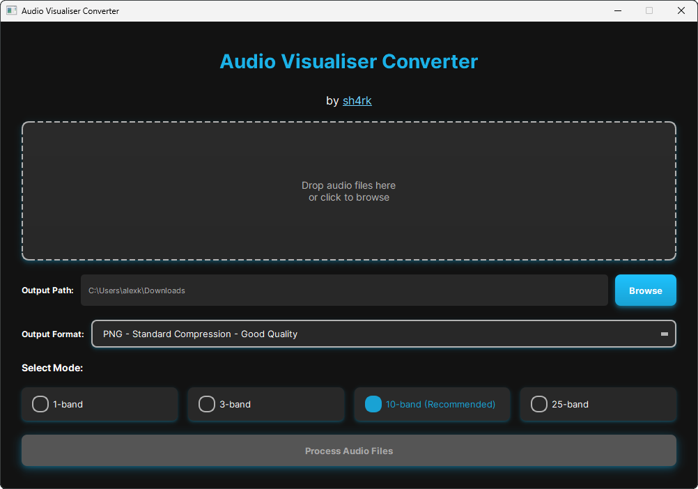

# Audio Visualiser Converter


An intuitive desktop application that converts audio files into multi-band waveform images, perfect for use with sh4rk’s Audio Visualiser plugin.

Created by **[sh4rk](https://sh4rkk.com/)** and **[Analator](https://portfolio-analator.web.app/)**

---

### Screenshot



---

## Features

- **Drag & Drop Interface:** Easily add audio files by dragging them into the application.
- **Multiple File Formats:** Supports `.mp3`, `.flac`, `.ogg`, `.wav`, and `.m4a`.
- **Selectable Processing Modes:**
  - **1-Band:** A classic, full-spectrum waveform.
  - **3-Band:** Splits audio into Low, Mid, and High frequencies (Red, Green, Blue).
  - **10-Band (Recommended):** Logarithmic frequency bands for detailed visualization.
  - **25-Band:** High-resolution frequency separation for professional use.
- **User-Friendly:** A clean, modern, and easy-to-navigate interface.
- **No Installation (for EXE):** The pre-compiled version works out-of-the-box on Windows.
- **Cross-Platform (from source):** The Python script can be run on Windows, macOS, and Linux.

---

## Getting Started

You have two options to use this application: the simple pre-compiled version or running the raw Python script.

We are providing both options for full transparency. Since the executable is not code-signed, some users may prefer to inspect the source code and run it directly.

### Option 1: Pre-compiled EXE (Recommended for Windows)

This is the easiest way to get started if you are on Windows.

1.  Go to the **[Releases Page](https://github.com/Analator1/Visualizer/releases)** of this repository.
2.  Download the latest `.exe` file from the assets.
3.  Run the application. No installation is required.

### Option 2: Running the Raw Script

If you prefer to run the application from the source code, follow these steps.

**Prerequisites:**
- [Python 3](https://www.python.org/downloads/)
- [FFmpeg](https://ffmpeg.org/download.html) (must be installed and accessible in your system's PATH, or place `ffmpeg.exe` in the same folder as the script).

**Installation:**

1.  **Clone the repository:**
    ```sh
    git clone https://github.com/Analator1/Visualizer.git
    cd Visualizer
    ```

2.  **Install the required Python packages:**
    ```sh
    pip install -r requirements.txt
    ```

3.  **Run the application:**
    ```sh
    python Visualiser_Script.py
    ```

---

## Dependencies

The script relies on the following Python libraries, which are listed in `requirements.txt`:

- `PyQt5`: For the graphical user interface.
- `numpy`: For efficient numerical operations on image data.
- `pillow`: For advanced image processing.
- `tqdm`: For progress bar functionality (used in the backend).

---

## License

This project is licensed under the MIT License - see the `LICENSE` file for details.
